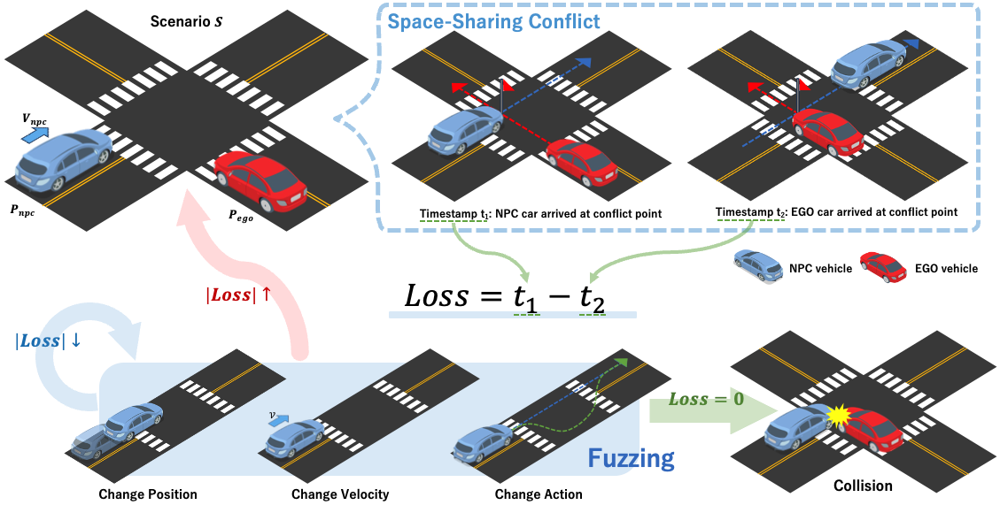
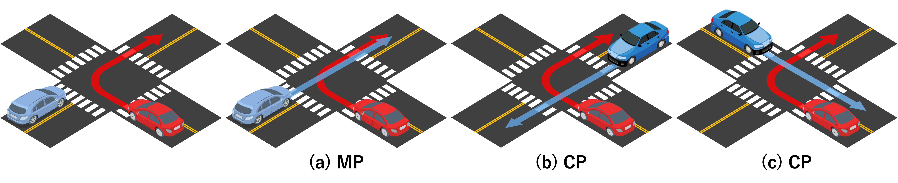

# Conflict-based Scenario Generation for Autonomous Driving System Validation
This is the implementation of our work ***Conflict-based Scenario Generation for Autonomous Driving System Validation***. 


## Environment
- Ubuntu 22.04
- Carla 0.9.15
- Python 3.9

## Usage
### 1. Install Carla
Download Carla from Carla's repo and extract it. In this work we use Version 0.9.15.
```Shell
wget https://tiny.carla.org/carla-0-9-15-linux
tar -zxvf carla-0-9-15-linux
```

### 2. Generate Scenario
Before running our code, we need to run Carla simulator first
```Shell
./Carla_root_dir/CarlaUE4.sh
```
Then we can run our code
```Shell
python run_exp_fuzzing_time_with_guiding.py
```
We implement our method in file `run_exp_fuzzing_time_with_guiding.py`, and also implement two baseline: **random** in file `run_exp_random_sampling.py` and **distance-based** in file `run_exp_fuzzing_distance.py`.

The results will be stored in `result` dir.

## Scenarios
In this work, we built 3 scenarios, as shown in the figure:

Their codes can be found as follows:
- __scenario (a)__: ./scenario/scenario_town05_case00
- __scenario (b)__: ./scenario/scenario_town05_case04
- __scenario (c)__: ./scenario/scenario_town05_case06